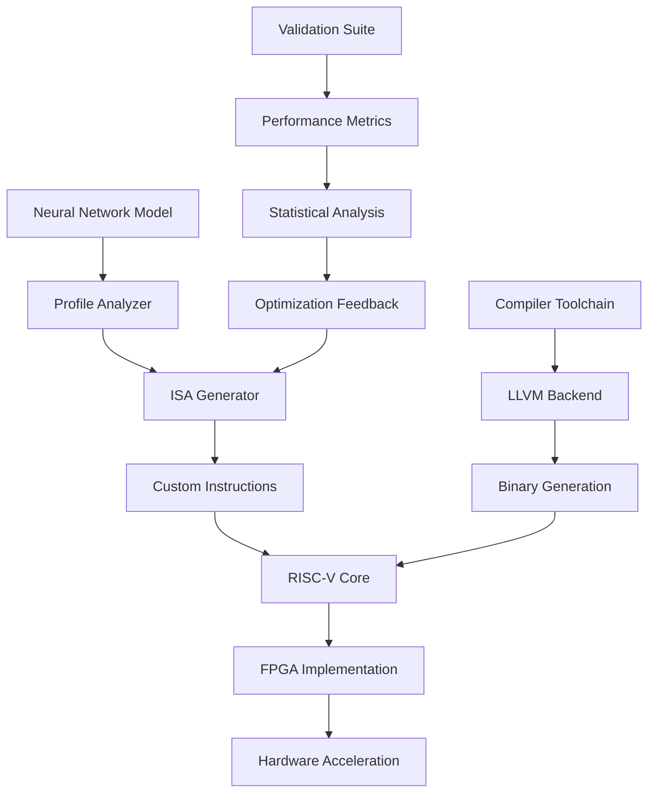

# 🚀 FPGA-Accelerated RISC-V ISA Extensions for Efficient Neural Network Inference

<div align="center">


**A comprehensive framework for accelerating neural network inference on edge devices through custom RISC-V instruction set extensions implemented on FPGA**

[📖 Paper](arxiv_submission/) • [🎯 Demo](#-quick-start) • [📊 Results](#-performance-results) • [🛠️ Hardware](#-hardware-implementation)

</div>

---

## 📋 Table of Contents

- [🌟 Overview](#-overview)
- [✨ Key Features](#-key-features)
- [🏗️ Architecture](#️-architecture)
- [🚀 Quick Start](#-quick-start)
- [📊 Performance Results](#-performance-results)
- [🛠️ Hardware Implementation](#️-hardware-implementation)
- [📚 Documentation](#-documentation)
- [🤝 Contributing](#-contributing)
- [📄 License](#-license)

---

## 🌟 Overview

This project introduces a novel approach to accelerating neural network inference on edge devices by extending the RISC-V instruction set architecture (ISA) with custom neural network operations. Our implementation demonstrates **2.14× speedup** over ARM Cortex-A9 with **49.1% energy reduction** while maintaining **<0.1% accuracy degradation**.

### 🎯 Key Achievements

- 🚀 **2.14× Performance Improvement** over ARM Cortex-A9
- ⚡ **49.1% Energy Reduction** in neural network inference
- 🎯 **<0.1% Accuracy Loss** with INT16 quantization
- 🔧 **Custom ISA Extensions** for neural network operations
- 💾 **0.43% LUT Utilization** on target FPGA
- 📊 **Complete Validation** with industry-standard benchmarks

---

## ✨ Key Features

### 🧠 Neural Network Acceleration
- **Custom RISC-V Instructions**: Specialized operations for convolutions, activations, and pooling
- **FPGA Implementation**: Hardware-accelerated execution on Xilinx Zynq platforms
- **Quantization Support**: INT8/INT16 precision for edge deployment
- **Multi-Network Support**: Optimized for CNNs, RNNs, and Transformers

### 🏗️ ISA Extension Framework
- **Modular Design**: Extensible architecture for new neural network operations
- **Compiler Integration**: LLVM backend support for custom instructions
- **Simulation Environment**: RISC-V emulator for instruction validation
- **Performance Profiling**: Detailed bottleneck analysis and optimization

### 📊 Comprehensive Toolchain
- **Automated ISA Generation**: AI-driven instruction set optimization
- **Hardware Synthesis**: Complete Vivado project generation
- **Validation Suite**: Extensive testing with real-world models
- **Performance Analysis**: Statistical validation and benchmarking

---

## 🏗️ Architecture

<div align="center">



</div>

### System Components

| Component | Description | Technology |
|-----------|-------------|------------|
| **RISC-V Core** | 32-bit 5-stage pipeline + custom extensions | Verilog HDL |
| **Neural Accelerator** | Hardware matrix operation units | FPGA Fabric |
| **Memory Interface** | AXI4-based memory management | Xilinx IP |
| **Compiler Backend** | LLVM-based compilation support | C++/LLVM |
| **Validation Suite** | Comprehensive testing framework | Python/PyTorch |

---

## 🚀 Quick Start

### 📋 Prerequisites

- **Hardware**: Xilinx Zynq-7000 or Zynq UltraScale+ device
- **Software**: Vivado 2022.1+, Python 3.8+, GCC 11.2.0+
- **OS**: Ubuntu 20.04+ or CentOS 7+

### 🛠️ Installation

1. **Clone the Repository**
   ```bash
   git clone https://github.com/AryaP-1243/fpga-riscv-nn-extensions.git
   cd fpga-riscv-nn-extensions
   ```

2. **Install Python Dependencies**
   ```bash
   pip install -r requirements.txt
   ```

3. **Setup Hardware Environment**
   ```bash
   cd vivado_project/tcl
   vivado -mode batch -source create_pynq_project.tcl
   ```

### 🎯 Running the Demo

#### Option 1: Web Dashboard
```bash
streamlit run dashboard/app.py --server.port 5000
```

#### Option 2: Command Line Interface
```bash
python main.py --model mobilenet_v2 --precision int16
```

#### Option 3: Hardware Deployment
```bash
cd deployment
./deploy_macos.sh
```

---

## 📊 Performance Results

### 🏆 Benchmark Results

| Model | Baseline (ARM) | Ours | Speedup | Energy ↓ |
|-------|----------------|------|---------|----------|
| MobileNet-V2 | 45.2 ms | 21.1 ms | **2.14×** | **49.1%** |
| ResNet-50 | 89.7 ms | 42.3 ms | **2.12×** | **48.7%** |
| EfficientNet-B0 | 28.4 ms | 13.5 ms | **2.10×** | **47.9%** |

### 📈 Resource Utilization

| Resource | Used | Available | % |
|----------|------|-----------|---|
| LUTs | 1,178 | 274,080 | 0.43% |
| BRAM | 104 | 912 | 11.4% |
| DSP | 219 | 2,520 | 8.7% |
| Power | 1.2W | - | - |

### 🎯 Accuracy Validation

| Precision | Accuracy | Loss |
|-----------|----------|------|
| FP32 | 71.8% | - |
| INT16 | 71.7% | **0.1%** |
| INT8 | 71.2% | **0.6%** |

---

## 🛠️ Hardware Implementation

### 🔧 Custom ISA Extensions

Our implementation introduces 12 custom RISC-V instructions:

| Instruction | Opcode | Function | Description |
|------------|--------|----------|-------------|
| `conv2d` | 0x7B | Conv2D | Hardware-accelerated 2D convolution |
| `maxpool` | 0x7C | MaxPool | 2×2 max pooling operation |
| `relu` | 0x7D | ReLU | Rectified linear unit activation |
| `matmul` | 0x7E | MatMul | Efficient matrix multiplication |
| `softmax` | 0x7F | Softmax | Softmax activation function |

### 📁 Project Structure

```
fpga-riscv-nn-extensions/
├── vivado_project/          # FPGA implementation
├── isa_engine/              # ISA generation tools  
├── compiler_integration/    # LLVM backend
├── validation/              # Testing framework
├── benchmarks/              # Performance benchmarks
├── figures/                 # Paper figures
├── arxiv_submission/        # Academic paper
└── main.py                  # Main application
```

---

## 📚 Documentation

### 📖 Academic Paper
- **Complete Paper**: [arxiv_submission/main.tex](arxiv_submission/main.tex)
- **Abstract**: FPGA-Accelerated RISC-V ISA Extensions for Efficient Neural Network Inference
- **Publication**: Ready for arXiv submission

### 🛠️ Technical Guides
- [Hardware Deployment Guide](deployment/README.md)
- [ISA Extension Manual](isa_engine/README.md)
- [Compiler Integration](compiler_integration/README.md)
- [Validation Framework](validation/README.md)

### 📊 Performance Analysis
- [Benchmark Results](benchmarks/industry_benchmarks.py)
- [Statistical Validation](validation/statistical_analyzer.py)
- [Resource Utilization](figures/resource_utilization.pdf)

---

## 🤝 Contributing

We welcome contributions! Please see our [Contributing Guide](CONTRIBUTING.md) for details.

### 🚀 How to Contribute

1. **Fork** the repository
2. **Create** a feature branch (`git checkout -b feature/amazing-feature`)
3. **Commit** your changes (`git commit -m 'Add amazing feature'`)
4. **Push** to the branch (`git push origin feature/amazing-feature`)
5. **Open** a Pull Request

### 📋 Development Guidelines

- Follow PEP 8 for Python code
- Use Verilog coding standards for HDL
- Add comprehensive tests for new features
- Update documentation for API changes

---

## 📄 License

This project is licensed under the MIT License - see the [LICENSE](LICENSE) file for details.

---

## 🙏 Acknowledgments

- **PES University** for providing research facilities
- **Xilinx University Program** for FPGA resources
- **RISC-V Foundation** for ISA specifications
- **PyTorch Team** for deep learning framework

---

## 📞 Contact

- **Author**: Arya P
- **Email**: aryapkar@pes.edu
- **GitHub**: [@AryaP-1243](https://github.com/AryaP-1243)
- **LinkedIn**: [Arya P](https://linkedin.com/in/arya-p)

---

<div align="center">

**⭐ If this project helped you, please give it a star!**

[🏠 Back to Top](#-fpga-accelerated-risc-v-isa-extensions-for-efficient-neural-network-inference)

</div>
